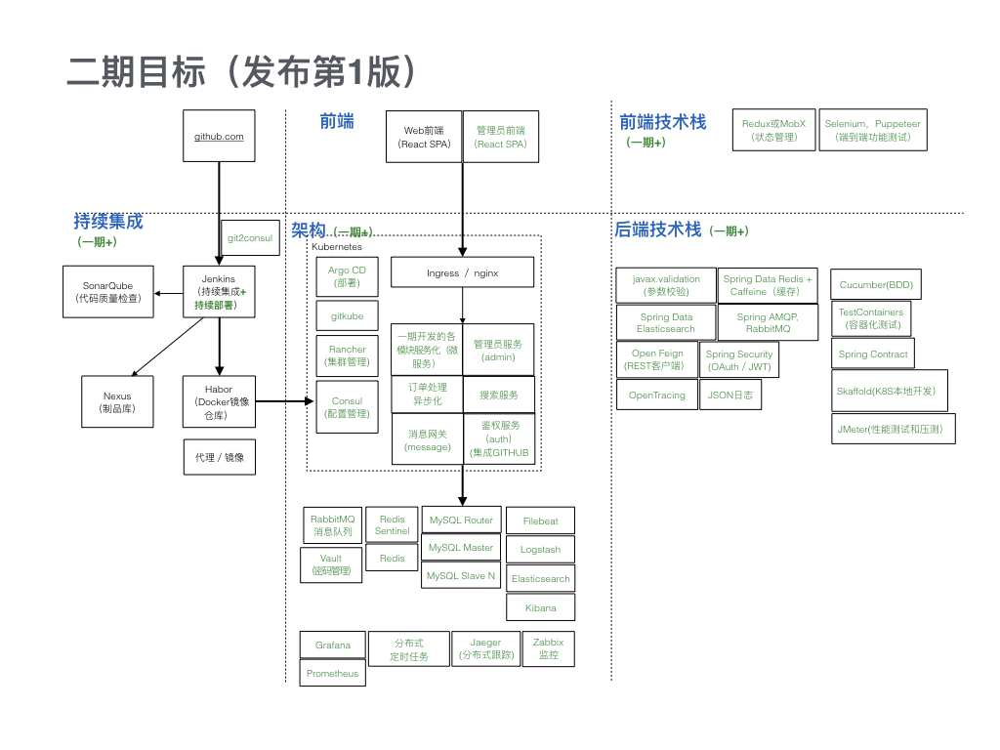
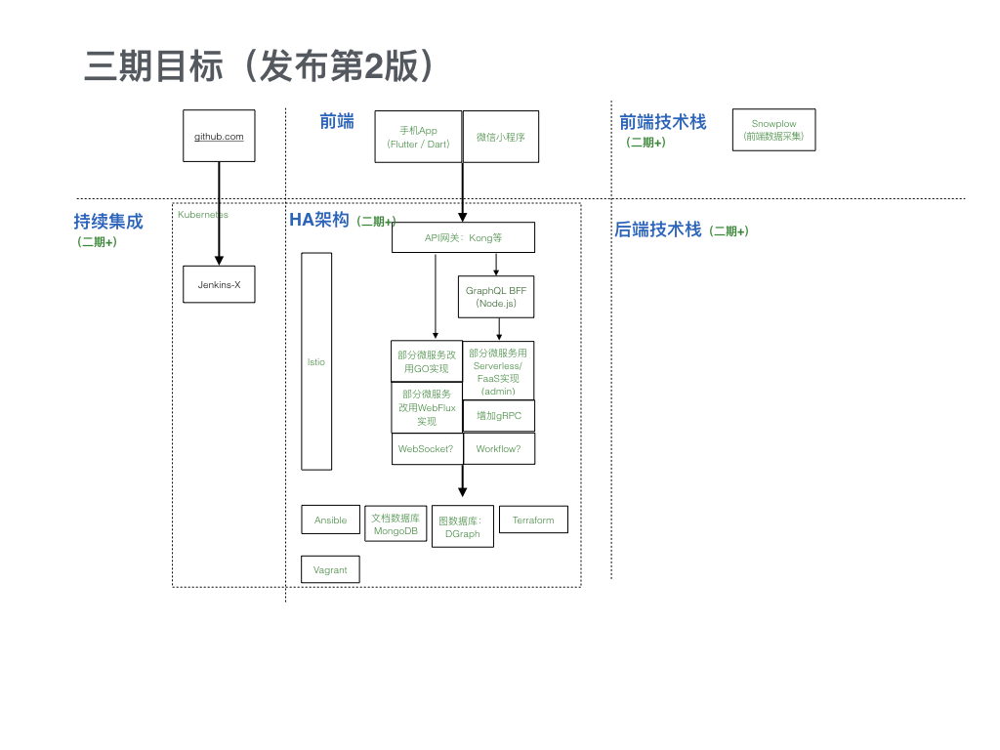
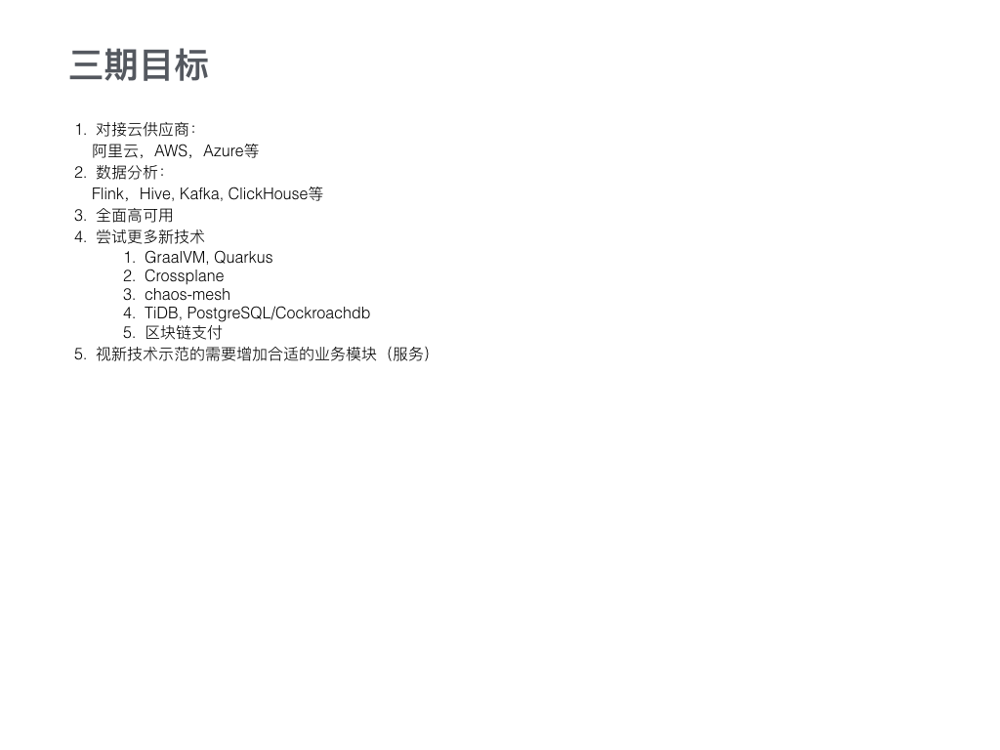

# 一个示范性项目：云原生的微服务开发工程

  项目刚启动，组队中，欢迎加入!
  这个项目是开放的，开源项目理论上没有门槛，谁想参加都可以，PR是最硬核的对参与程度的衡量，PR一合并会自动记入贡献者名单。
  一期开发已经开始。但是参加开源项目并不只是写代码，很多人会因为时间精力等各种原因还没法直接参与开发。其实做贡献的方式有很多种，不是只有PR才算是参与了，很欢迎大家能，除了直接提交代码，贡献的重要程度按顺序排列如下：
  1. 帮助审核代码PR：https://github.com/engineer-365/cloud-native-micro-service-engineering/pulls
  2. 参与discussion：https://github.com/orgs/engineer-365/teams/engineers-engineer-365/discussions
  3. 提交Issue：https://github.com/engineer-365/cloud-native-micro-service-engineering/issues
  4. 其它方式也请提建议！

## 两个出发点

   - 示范完整的云原生的微服务架构

     已有的开源项目，Spring Cloud系列貌似更多，云原生的微服务架构其实也是一个主流路线，会成为甚至已经成为下一代新的技术。种种原因，在国内的普及程度相对滞后，值得我们去做些什么。

   - 整个开发过程以接近实际工程的方式展示出来，包括但不限于：持续集成、持续部署、自动化运维、多开发环境管理，等等

     我做了调研，总结下来是，有的专注于某一技术点，有的专注于小范围内的整合，有的专注于完整的产品级代码，还有的专注于教学式的课程。代码和工程的系统结合目前我没看到，但价值的分量明显足够。

## 具体想法：
   - 采用云原生的微服务架构: Docker, Kubernetes, ServiceMesh。
   - 实现一个功能需求上能覆盖计划的技术栈的Web应用，目前考虑是一个二手计算机图书电商系统，注意，是<b>真的准备让大家的书上架的</b>！
   - 前后端分离，以后端为主，后端最初会以JAVA的Spring Boot全家桶开始，包括MySQL、Redis、RabbitMQ、ElasticSearch等基本的主流技术栈，然后一步步增加别的，包括支持GO等其他语言；前端最初用React或Vue的全家桶开发SPA Web应用，然后扩展到小程序和手机App，逐步建立大前端体系。
   - 自动化测试：单元测试、集成测试、性能测试、压力测试、端对端功能测试。整体测试覆盖率达到100%。
   - 以DevOps和GitOps为理念的工程开发体系：
     - 持续集成（CI），持续部署（CD）
     - 自动化运维、自动化监控报警、集中式日志、分布式调用链路追踪
     - 部署私有仓库
     - 整合常见开发工具，譬如SonarQube, Slack，GITHUB Issue、GITHUB Project等。
     - 建立示范性的本机开发环境、测试环境、预生产环境和线上生产环境
   - 所使用的每一项技术都建立指南文档。
   - 后续会加入大数据分析。
   - 考虑演进成Serverless/FaaS，目前还没定，也可能会是另一个新项目。

## 如何报名参加？

  1. 请Fork这个项目，把你的GITHUB账号名加到[./members.md](./members.md)那个文件，然后提交PR，等待合并。

  2. Watch这个项目，任何项目变动都能得到邮件通知。

  3. PR合并成功后，加入QQ群1033056382（目前不打算用微信）。加群时需要回答你提交PR时用的GITHUB账号。

  4. 入群后，请把你的群内昵称改为GITHUB账号名，否则会被踢出。

  5. 可选：Star一下，有助于我们找到更多参与者

  对这个过程如果有什么问题，可以提交Issue [https://github.com/engineer-365/cloud-native-micro-service-engineering/issues]

## 目标：

   （欢迎补充等建议）

  - 一期开发：
    - 阶段性目标：
      - 最小化功能实现，前后端打通，但只实现书店顾客前端，不做管理员后端
      - 模块化的单体应用
      - 手动部署，直接上线运行
    - 阶段性技术栈：
      - 后端 -> Java技术栈:
         - [ ] Spring MVC: REST API(JSON), Swagger (Spring Fox)
         - [ ] 测试: Junit5 (单元测试), Mockito (Mock), JaCoCo (测试覆盖率分析)
         - [ ] 数据库访问：Spring Data JPA（Hibernate），QueryDSL（动态查询），Flyway（数据库升级管理）
         - [ ] 日志：Logback
         - [ ] Jar包依赖管理：Maven
         - [ ] Spring Boot Actuator：监控数据采集和管理
         - [ ] 其他：Guava（工具类），Lombok (Java Bean代码生成)
      - 前端 -> React全家桶：
         - [ ] Webpack
         - [ ] 路由：React Router
         - [ ] UI库：Material Design或Ant Design
         - [ ] REST客户端：Axios
         - [ ] 测试：Jest或Mocha
      - [ ] Nginx做前端静态页面和后端API的统一入口
      - [ ] 关系数据库：MySQL单节点，H2（测试用）
      - [ ] 持续集成（CI）：Jenkins, SonarQube (代码质量检查)
      - [ ] Maven私有仓库：Nexus，或JFrog
      - [ ] 私有Docker仓库：Habor
      - [ ] 开发者本地Docker开发环境：Docker-compose
      - [ ] 用Helm或Kustomize手动部署到Kubernetes
      - [ ] Spring Boot Admin
  

  - 二期开发：
    - 阶段性目标：
      - 主要功能全部实现，包括管理员前端
      - 初步实现云原生的微服务架构
      - 自动部署
    - 阶段性技术栈
      - 后端增加：
        - [ ] 参数校验: javax.validation (JSR-303, Hibernate Validator)
        - [ ] 测试: Cucumber, TestContainers (容器化测试)，JMeter (性能测试和压测)，Contract
        - [ ] 权限控制：Spring Security (OAuth + JWT)
        - [ ] 日志：JSON日志格式
        - [ ] REST客户端: Resilience4J，Spring RestTemplate或Open Feign
        - [ ] 缓存：Jedis, Spring Data Redis, Caffeine
        - [ ] 全文检索：Spring Data Elasticsearch
        - [ ] 消息队列：Spring AMQP, RabbitMQ
        - [ ] 定时任务：TBD
      - 前端增加：
        - [ ] 状态管理：Redux或MobX
        - [ ] 测试：Selenium，Puppeteer
    - [ ] 关系数据库：高可用MySQL集群（MySQL Router + Group Replication + MySQL Shell）
    - [ ] 持续部署（CD）：Ranchor(Kubernetes集群管理），gitkube, ArgoCD（自动部署到Kubernetes）
    - [ ] 分布式缓存：Redis, Redis Sentinel
    - [ ] ELK (Elasticsearch + Logstash + Kibana): 全文检索，日志管理
    - [ ] 配置集中管理：Consul，Vault（MySQL等密码管理），Git2Consul
    - [ ] 分布式调用链路追踪：OpenTracing, Jaeger
    - [ ] 监控报警：Prometheus，Grafana
    - [ ] Skaffold
  

  - 三期开发：
    - 阶段性目标：
      - 主要功能全部实现
      - 完整实现云原生的微服务架构
      - 支持多语言
      - 云原生的持续集成、持续部署、自动化运维
    - 阶段性技术栈
      - 后端：
        - [ ] 支持用GO，Python，Node.JS，PHP开发微服务
        - [ ] 部分微服务改用Serverless/FaaS实现
        - [ ] 部分微服务改用异步/WebFlux实现
        - [ ] GraphQL API
        - [ ] gRPC
        - [ ] WebSocket
        - [ ] Workflow
      - 前端：
        - [ ] GraphQL API
        - [ ] snowplow
      - [ ] API网关：Kong，Ambassador，Gloo或Traefix？
      - [ ] ServiceMesh: lstio
      - [ ] NoSQL数据库：MongoDB, Neo4J
      - [ ] 自动化运维：Ansible，Vagrant，Terraform
      - [ ] Jenkins-X
  

  - 四期开发：
    - 阶段性目标：
      - 对接云供应商：阿里云，AWS，Azure等
      - 大数据分析：Flink，Hive, Kafka, ClickHouse等
      - 全面高可用
      - 尝试更多新技术
      - 手机App、微信小程序
    - 阶段性技术栈
      - GraalVM, Quarkus
      - Flutter
      - Crossplane
      - chaos-mesh
      - TiDB, PostgreSQL/Cockroachdb
  

## 问答：

> 1. "太多了，一看就跟不上，就连这个简介都看不懂"

  首先，我的观点是：看得懂就不用一起学了。很多我也只是个大概的了解，一步一步来吧，让我们在实践中一起学习。现在的趋势就是云原生、微服务、DevOps，列出的这些技术是在跟着大趋势走，避免走弯路，避免重复发明轮子，希望走到主流的前排里。跟着教程书学效果不好，真正的技术只可能在系统化的实践中才学得到学得好。

  然后，太多的技术点（实际上还只是一小部分）恰恰也是为什么要发起这个项目的原因之一：想示范如何系统的使用这些技术。列出这么多名词术语有些唬人，因为大部分其实是成熟公司里已经用起来的技术，但是对刚入门的程序员来说就是个门槛，会懵，用过了、过了这个门槛，会发现很多事情只是知道不知道的区别。

 > 2. “为什么不是Spring Cloud？”

  云原生是微服务架构的主流路线之一，特点是服务治理的实现需要代码修改量少甚至不需要修改，意味着代码侵入性小，多语言支持方便，扩展性强。

  另一方面，Spring Cloud的优秀开源演示项目已经很多，相对来说云原生方案因为比较新，项目发展空间更大，而且，云原生架构对基础架构和工程规范化的要求更高，而演示基础架构和规范化的工程开发正是这个项目的主要目标之一，希望能通过这个项目为促进云原生方案的普及作出贡献。

  另外，项目里会用到一些Spring Cloud体系内的组件，但总体来说，并不是Spring Cloud的方案。

> 3. “我不喜欢或者不习惯你提到的技术，我还想尝试一个更新的技术，能不能换成xx？”，譬如，有群友提到：“最近正好有计划做一个类似的，想做的平台是基于vertex的kotlin和actix的rust，以及尽量全套的异步组件，顺便试试postgresql。”

  选择成熟的主流技术是刻意的，这个项目的主要目标不是调研和尝鲜，主要目标是让大家脱离教程和作坊式的开发，让大家有机会实践贴近真实的规范化的工程开发。涉及的方方面面的细节会很多很杂，所以，为了降低项目失败的可能性，至少在前两阶段的计划中，我刻意采取了保守的技术选择策略。

  这和尝试更新的技术并不矛盾，在初期的迭代取得了阶段性成果以后，我们会得到一个很好的平台，我们会更有士气更有真实需求去实践更多的东西，甚至做些重复发明轮子的事情都可以。

  所以，就拿上面这个问题提到的“异步/非阻塞”的这个话题来说，因为在典型的Java Web应用系统里异步还不是主流，所以虽然这个想法不错，可是不太适合初始阶段，后续肯定会尝试异步方案。

> 4. “一开始关注后端就好了，也不仅仅限制于前后端分离，需要的是提供如何将自己的前端技术栈接入该后端项目的接口规范和指南，像react，vue，或者后端渲染，或者模板引擎等等”

  第一期计划里是安排了实现一个书店顾客的Web前端，因为定位是一个系统化的工程化的演示性项目，前后端一起联动着实践才能体现工程中一个接口的开发过程。

> 5. "可以提供一些项目额外的包，例如该项目叫awesome, 就可以提供awesome-react-starter, awesome-vue-starter, awesome-blazor-starter, 毕竟专注后端，在一个项目集成与前端相关的一些东西多少会有些不好"

  是的，会产出一些框架性的胶水性的代码和工具，会控制在很薄的一层封装上，目的是减少重复代码，提高工程效率和架构细节上的的一致性。顺便强调一下，这个项目并不是专注后端，而是因为通常产品开发围绕着后端作为中心，所以目前重点演示以后端为主的完整产品开发工程。

